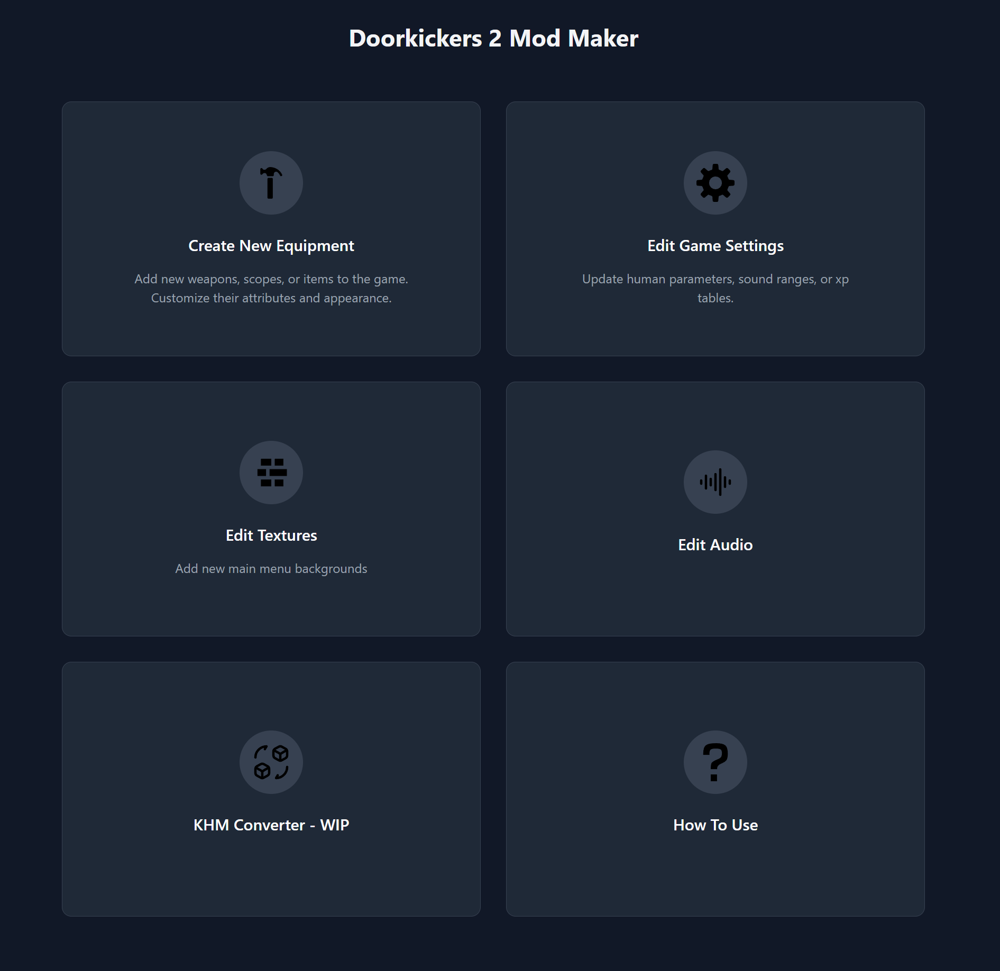

# Doorkickers 2 Mod Maker

A simple, web-based tool for creating and customizing mods for **Door Kickers 2**.

Supports quick editing and generation of:

- Equipment
  - Ammo
  - Armor
  - Firearms _(WIP)_
  - Scopes
- Classes _(WIP)_
- Game Settings
  - Human Parameters
  - Sound Ranges
  - XP Tables
- Textures
  - Background Image
- Music
- KHM Viewer & Converter _(WIP)_

Try it at: [dk2modmaker.com](https://dk2modmaker.com/)



## Getting Started

```bash
npm install
npm run start
```

## Build for Production

```bash
npm run build
```
